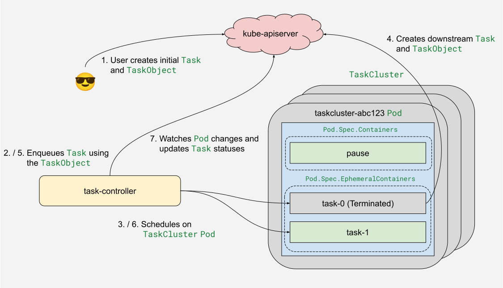
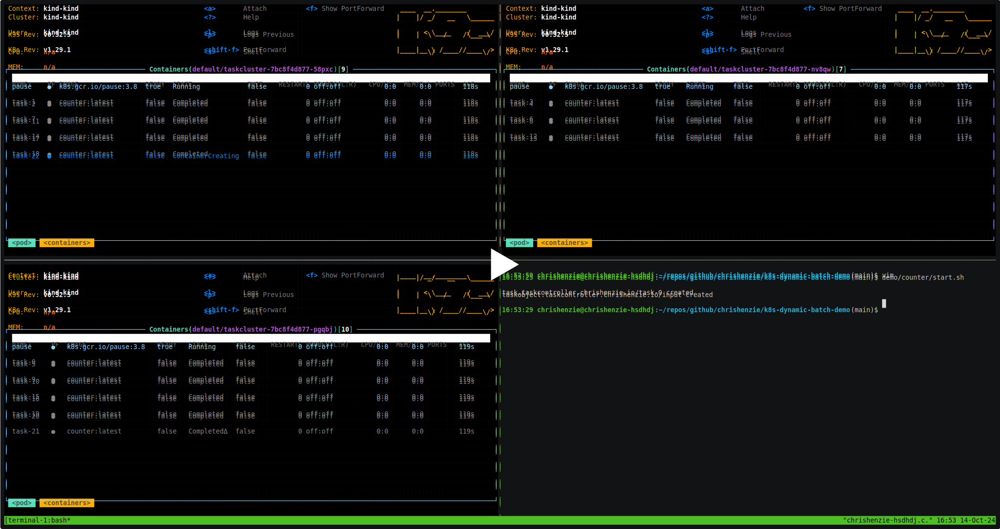

# Dynamic Batch Workloads with Kubernetes Custom Resources

This is a prototype for running dynamic batch workloads using Kubernetes Custom
Resources (CRDs) and a custom controller. The primary goal is to extend
Kubernetes with support for managing workloads that can evolve dynamically
during execution, with inspiration drawn from the [Ray.io](https://ray.io)
framework.

The project introduces three new CRDs: **Tasks**, **TaskObjects**, and
**TaskClusters**. These are managed by a custom controller that handles the
orchestration of worker Pods and task scheduling.

For more background, refer to [@dchen1107](https://github.com/dchen1107)'s
[proposal](https://shorturl.at/PnzW8) and the Ray.io
[whitepaper](https://docs.ray.io/en/latest/ray-contribute/whitepaper.html).

## Components

- `Task`: Represents a lightweight unit of work, which can trigger the creation
  of downstream Tasks. Tasks are executed as ephemeral containers inside a
  worker Pod.
- `TaskObject`: Holds the input arguments needed by a Task. Currently, this is
  implemented as a `map[string]string`.
- `TaskCluster`: A set of worker Pods available to run Tasks.
- `task-controller`: Manages the lifecycle of Tasks and TaskClusters, and Task
  scheduling.

### Task Lifecycle

[]()

The `task-controller` continuously watches for new Tasks and TaskObjects. When a
TaskObject is created, the controller identifies the corresponding Tasks that
use it and enqueues them for reconciliation.

When a Task starts, it fetches its definition along with its input from the
Kubernetes API server. The Task parses the input to extract any function
arguments. The Task then performs whatever work it needs to do. If needed, the
Task will create new Tasks and their corresponding TaskObjects.

The controller also monitors Pods where Tasks are running. When a Task
terminates, the status of the ephemeral container within the Pod is updated.
This Pod update triggers the controller to inspect the Pod’s ephemeral container
statuses and enqueue its Tasks for reconciliation.

## Demo: Counter Task

A simple example is provided in the `demo/counter/` directory, which increments
a counter. It does the following:

1. Creates `task-0` with a starting `count` and `limit`.
1. Inside the Task, it checks if `count >= limit`.
1. If not, it creates a new Task and TaskObject with `count = count + 1`.
1. This continues until `count == limit`.

You can see the demo in action on [asciinema](https://asciinema.org/a/RgZS1VOMVw0RNDms4MvkAojgn).

[](https://asciinema.org/a/RgZS1VOMVw0RNDms4MvkAojgn)

**NOTE:** The video above uses a [forked
version](https://github.com/chrishenzie/k9s/tree/ephemeral-containers) of
[k9s](https://k9scli.io) that can also watch for ephemeral container changes.
You will need to build this separately to reproduce the video.

### Running the Demo

Follow the steps below to set up and run the demo:

```bash
# Create and set up a kind cluster with Task CRDs and the controller.
# NOTE: Requires kind to be installed. The script will prompt if kind is not found in $PATH.
demo/counter/setup.sh

# Create the "counter" Task, which will trigger downstream Task creation.
demo/counter/start.sh

# Watch for changes to the Task resources, or you can follow along using k9s
(see above).
demo/counter/watch.sh

# Verify the final count equals the limit.
demo/counter/verify.sh
```

**NOTE:** [`kind`](https://kind.sigs.k8s.io/), [`docker`](https://docker.com/),
and [`kubectl`](https://kubernetes.io/docs/reference/kubectl/) are required for
the above scripts to work.

## Known Limitations

- **Support for More Complex Data Types**: Currently, the data in a TaskObject
  is implemented as a simple `map[string]string`, which limits the complexity of
  input data that can be passed to a Task.
- **Support for Removing Ephemeral Containers from Pod Spec**: Kubernetes does
  not support removing ephemeral containers from a `Pod.Spec`. This means the
  Pod's spec grows as more Tasks run, potentially leading to scalability issues
  over time.

## Long-Term Vision

The long term goal of this prototype is simplifying the complexity of running
dynamic batch workloads on Kubernetes. A key part of this is abstracting away
many of the details involved in how Tasks receive input and trigger downstream
work. Ideally we should provide libraries to encapsulate these lower-level
mechanisms so developers can focus on their application code.

## Contributing

Contributions are welcome! Please open an issue or submit a pull request if you
have ideas or improvements.
